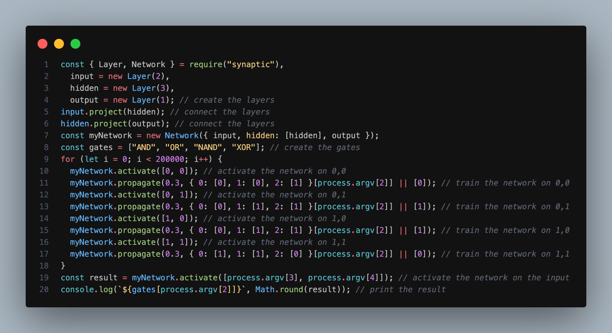

# Basic Logic Gate Calculator

> Node.js app that calculates the result for 4 different basic logic gates in **_20 lines of code_**

## Logic Gates

Logic gates are based on the boolean function and carry out logical operations.
These logic gates take a number of inputs (usually 2) and return an output.
Here are the resolution tables for the logic gates used in this application

### AND Table

| Input 1 | Input 2 | Output |
| ------- | ------- | ------ |
| 0       | 0       | 0      |
| 0       | 1       | 0      |
| 1       | 0       | 0      |
| 1       | 1       | 1      |

### OR Table

| Input 1 | Input 2 | Output |
| ------- | ------- | ------ |
| 0       | 0       | 0      |
| 0       | 1       | 1      |
| 1       | 0       | 1      |
| 1       | 1       | 1      |

### NAND Table

| Input 1 | Input 2 | Output |
| ------- | ------- | ------ |
| 0       | 0       | 1      |
| 0       | 1       | 1      |
| 1       | 0       | 1      |
| 1       | 1       | 0      |

### XOR Table

| Input 1 | Input 2 | Output |
| ------- | ------- | ------ |
| 0       | 0       | 0      |
| 0       | 1       | 1      |
| 1       | 0       | 1      |
| 1       | 1       | 0      |

> Computers use these logic gates to complete many tasks like adding numbers or storing information (memory).
  
Lets say we want to run the inputs: `1` and `0` into the XOR function. By doing this, we would get an output of `1`

## Synaptic JS

Synaptic is a javascript neural network library for node.js and the browser, its generalized algorithm is architecture-free, so you can build and train basically any type of first order or even second order neural network architectures.

Read more about [Synaptic](https://github.com/cazala/synaptic)

### A Little About Neural Networks

The first building block of a neural network is, well, neurons.

A neuron is like a function, it takes a few inputs and returns an output.

There are many different types of neurons. Our network is going to use sigmoid neurons, which take any given number and squash it to a value between 0 and 1.

The circle below illustrates a sigmoid neuron. Its input is 5 and its output is 1. The arrows are called synapses, which connects the neuron to other layers in the network.

So why is the red number 5? Because it’s the sum of the three synapses that are connecting to the neuron as shown by the three arrows at the left. Let’s unpack that.

At the far left, we see two values plus a so-called bias value. The values are 1 and 0 which are the green numbers. The bias value is -2 which is the brown number.

First, the two inputs are multiplied with their weights, which are 7 and 3 as shown by the blue numbers.

Finally, we add it up with the bias and end up with 5 or the red number. This is the input for our artificial neuron.

As this is a sigmoid neuron which squashes any value to between 0 and 1, the output gets squeezed down to 1.

If you connect a network of these neurons together, you have a neural network. This propagates forward from input to output, via neurons which are connected to each other through synapses. Like on the image below:

The goal of a neural network is to train it to do generalizations, such as recognizing handwritten digits or email spam. And being good at generalizing is a matter of having the right weights and bias values across the network. Like with the blue and brown numbers in our example above.

When training the network, you’re simply showing it loads of examples such as handwritten digits, and getting the network to predict the right answer.

After each prediction, you’ll calculate how wrong  the prediction was, and adjust the weights and bias values so that the network will guess a little bit more correct the next time around. This learning process is called backpropagation. Do this for thousands of times and your network will soon become good at generalizing.

## Using the app

- Clone the app: `git clone https://github.com/amjedidiah/20-lines-of-code.git`
- CD into the app directory: `cd 20-lines-of-code`
- Install dependencies: `npm install`
- Run the command for a logic gate: `node app.js <logic_gate> <input 1> <input 2>`
    > The logic gates are 0: `AND`, 1: `OR`, 2: `NAND`, 3: `XOR`
    > The inputs are either `0` or `1`

For example, to run the inputs `1` and `0` into the XOR function, you would run the command: `node app.js 3 1 0`

Happy coding!

## More Ideas

- [API and Discord Bot](https://dev.to/shreyazz/make-a-discord-bot-in-just-30-lines-of-code-44el)
- [API](https://learningactors.com/make-your-own-api-under-30-lines-of-code/)

## Resources

- [How to create a Neural Network in JavaScript in only 30 lines of code by Per Harald Borgen](https://www.freecodecamp.org/news/how-to-create-a-neural-network-in-javascript-in-only-30-lines-of-code-343dafc50d49/)
